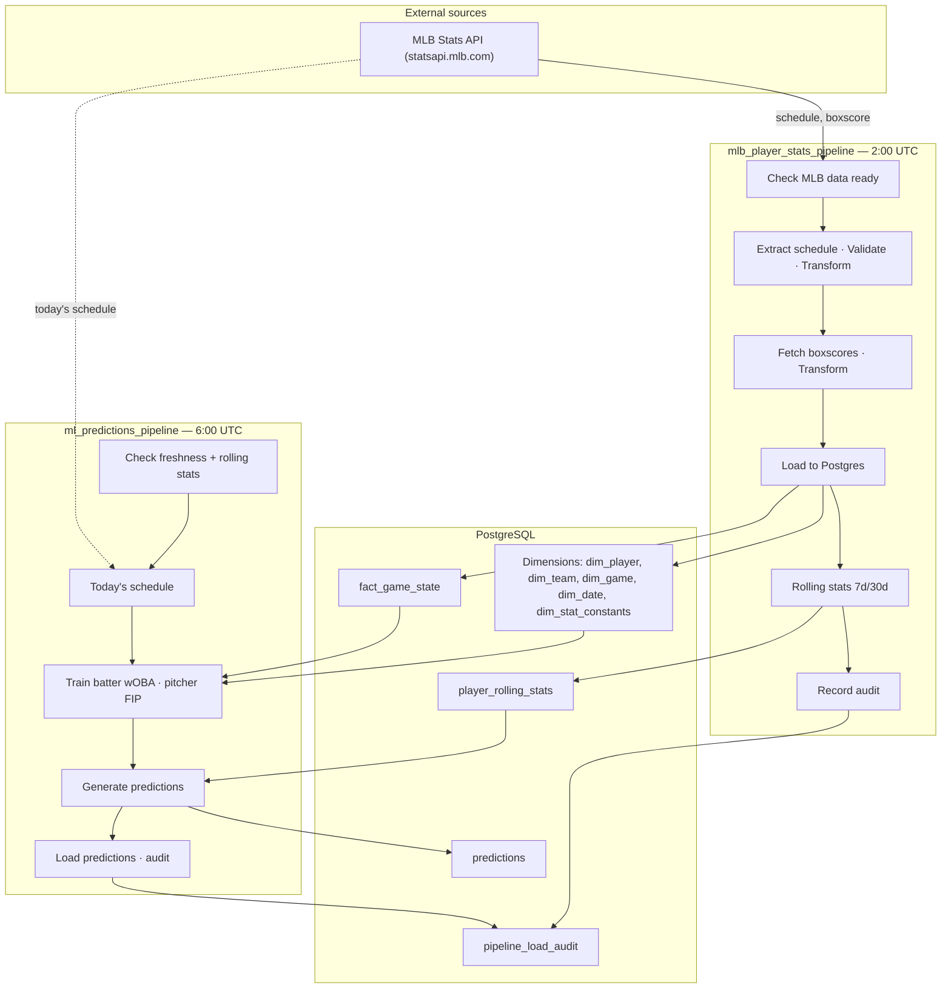

# Baseball Eval Flow — Data Architecture

One-page view of data flow: **sources → pipelines → database**.

---

## Diagram

---

## Flow summary

| Layer | Description |
|--------|-------------|
| **External** | MLB Stats API (schedule + boxscore per game). |
| **ETL (2:00 UTC)** | Sensor → extract yesterday’s games → validate/transform → fetch player stats → load into star schema → compute 7d/30d rolling stats → record load audit. |
| **ML (6:00 UTC)** | Check upstream freshness and rolling stats → get today’s schedule → train batter (wOBA) and pitcher (FIP) models → generate predictions → load into `predictions` and record audit. |
| **PostgreSQL** | Star schema (dimensions, `fact_game_state`), `player_rolling_stats`, `predictions`, and `pipeline_load_audit` for dependencies and freshness. |

---

For a **printable one-page visual**, open [data_architecture.html](data_architecture.html) in a browser and use **File → Print → Save as PDF**.
